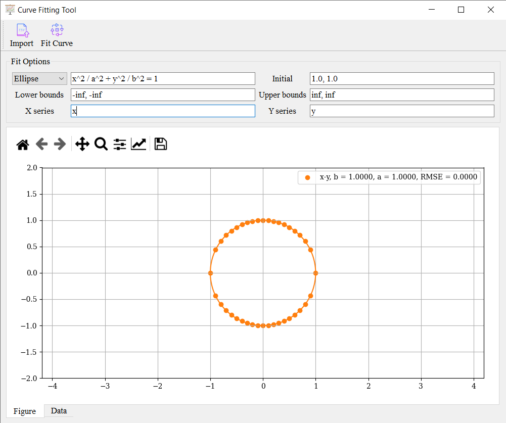

# cftool
A Curve Fitting Tool

cftool (Curve Fitting Tool) is a program to do the curve fitting. It supports curve fitting of implicit equations. 

## Screenshot

## Downloads

Download the program [here](https://github.com/haiiliin/cftool/releases/latest).

## Usage

Go [haiiliin.com/cftool](https://haiiliin.com/cftool) for usage of the program.
